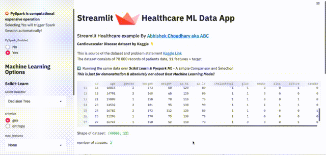

# Streamlit Healthcare Machine Learning Data App



## Objective
1. How easy is it to create a Web App using Streamlit
2. Integrating multiple #machinelearning technologies in the same app
3. Code reusability
4. Streamlit functions & feature usage

>  of-course Dockerize!

## Running the App

1. Checkout the code
 ```
 git checkout
``` 
2. Build the docker image
```buildoutcfg
docker build --tag streamlit-healthcare:1.0 .
```
3. Run the docker image
```buildoutcfg
docker run -it -p 8501:8501 streamlit-healthcare:1.0
```
4. Browse the [url](http://localhost:8501)

## Features
* Load Healthcare data from Kaggle https://www.kaggle.com/sulianova/cardiovascular-disease-dataset
* Use __scikit-learn__ ML lib to run classification.
* Provide Tuning param options in the UI 
* Provide Switch to enable __PySpark__
* Provide Pyspark MLlib options over the same data, technically one can compare 
the result between 2 seperate libraries
* Plotting using Seaborn chart

## Conclusion

Streamlit is essentially a very straightforward easy library to create
python based Webapp. 
I am Convinced 👏👏👏